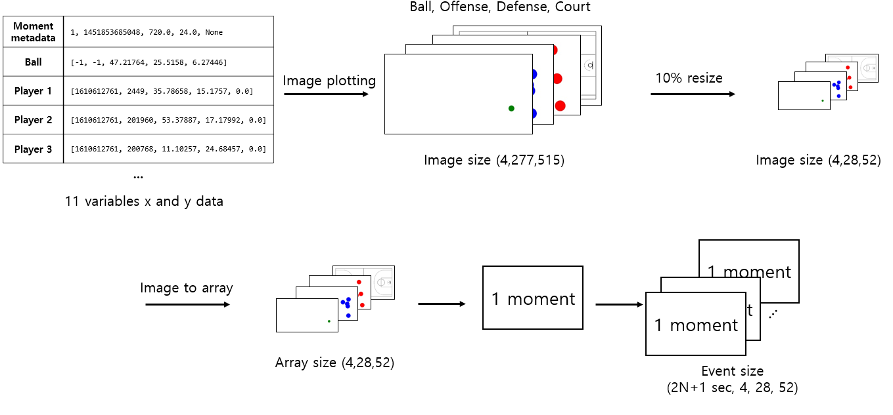
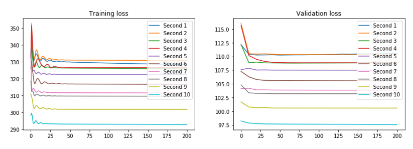
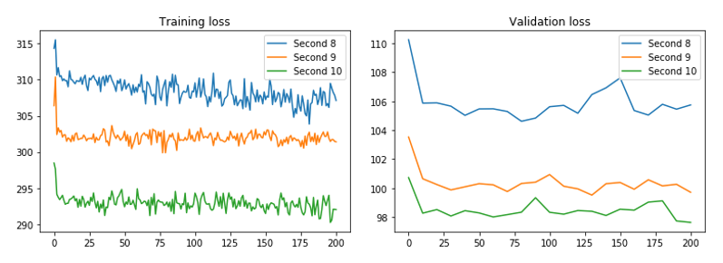

# Final project
<div style="text-align: right">Suhwan Lee 20195188  </div>
<br />

> Code description in [codebook.md](./codebook.md)

## Abstract
This project paper describes an application of a deep learning model at game event result prediction with the basketball possession. Two different models are applied to predict whether the offense team in the event makes a goal or not with players and ball location changes from the beginning of the event to the given period. 5 players of each team and the ball location coordinates with time-series arrays are used as input data, 11 variables. These variables are transformed into image data to represent a series of game snapshots to verify how the formation transition of the team would lead to the game event result in a meaningful manner. 

## 1 Introduction

The audience and fans of a sports game, two participants are competing to win the game, are eager to know the result of the game
and put efforts to guess in the aspect of love to the team or for economical benefits.
In case of team games and the winner is chosen by the team which gets more scores than other,
various attempts and methods are adopted to predict the score of each team.
In the quantitative analysis point of view, team and the contributors, for example 
player, supervisor, coach, or the owner of the clubs' ability, are represented in numerical value,
such as previous game scores or success rate of offense chance through historical data.

The other method to measure the performance of a team is expressed in a qualitative view.
One of the typical approaches is observing player location in the field and extracting
features from a snapshot of the game field how the formation and arrangement of players affect
the consequence, i.e., in detail which teams are formed coherently and organized rather than opponents or
as a counterstrategy how the team copes with the opponents in optimal formation.
Even the main team strategy is determined before the beginning of the game, for optimal reaction
to opponents, detail strategy should dynamically change, e.g., formation at offense or defense situation in 
football, to achieve the chance or handle the threats.

In this project, the deep learning model is applied to predict the event consequence in a basketball game,
i.e., binary classifying hundreds of _events_ in two groups whether offense gets a score or not at a single game.
The _event_ is a single attack by offense team which has a possession until the defense team
gains possession or offense team makes a score.[[1]](#footnote_1) The real game data are collected from 
NBA SportVU log, which has player movement in a series of time with the ball and player location in x and y coordinates.
By changing the event duration from 1 second to 10 seconds, the model takes input data as variable location
information from the beginning of events until the end of the given duration and print the output into two categories,
1 as a success of event (make event) and 0 as a failure of event (miss event).

The final paper is organized as follows. Section [2](#sec2) describes used data in detail with
basic analysis,  input and output data features, and evaluation for the experiment.
Section [3](#sec3) introduces the idea of experiment and model architecture in detail. The experiment
results are presented and discussed in Section [4](#sec4)

## <a name="sec2"> 2 </a> Problem description
In this project, 5 basketball game is considered [[2]](#datasource), since the original data only contains x and y locations
of variables but event information is missing, retrieving additional event-related information from 
NBA sportVU is followed. [[3]](#eventsource) Data gathering process and code is described in this [file](./figuringevent.py).

### 2.1 Data in detail quantify and features
#### 2.1.1 Game metadata and moment information
The game log has 'gamedate', 'gameid', and 'events'. In each 'events', there are 4 keys,'eventId', 'visitor', 'home', and 'moments'.
'visitor' and 'home' are the teams in the game. Figure 1 shows an example of game metadata.


_Fig1. Team and player data sample_

```
{'name': 'Chicago Bulls', 'teamid': 1610612741, 'abbreviation': 'CHI', 
'players': 
{'lastname': 'Rose', 'firstname': 'Derrick', 'playerid': 201565, 'jersey': '1', 'position': 'G'}, 
```  

Each event has multiple moments that contain the time, ball, and player location information.
A moment is a kind of snapshot in the event that 25Hz (0.04sec) is an interval between back to back moments.
Like in fig2, the first element represents a quarter of the game, event in a millisecond, remaining time of the quarter, and the remaining time of the shot clock.
The first of the second element is ball information, the first two elements are meaningless, the following three numbers are x, y, and z coordinates.
The next 10 elements are player location information that contains team id, player id, and x,y,z coordinates.

_Fig2. Moment sample_
```
[1, 1451853685048, 720.0, 24.0, None, 
[[-1, -1, 47.21764, 25.5158, 6.27446], 
[1610612761, 2449, 35.78658, 15.1757, 0.0], 
[1610612761, 201960, 53.37887, 17.17992, 0.0], 
[1610612761, 200768, 11.10257, 24.68457, 0.0], 
[1610612761, 201942, 44.51259, 31.75615, 0.0], 
[1610612761, 202685, 45.58883, 24.74635, 0.0], 
[1610612741, 2200, 48.27744, 23.36449, 0.0], 
[1610612741, 2550, 72.71426, 23.69474, 0.0], 
[1610612741, 201959, 55.28239, 18.09477, 0.0], 
[1610612741, 202710, 48.29287, 32.01074, 0.0], 
[1610612741, 202703, 63.3566, 25.57804, 0.0]]]
```

#### 2.1.2 Event description
With given game ID, the following tables like in table 1 data is collected. Through labels and
index of event, 12 types(EVENTMSGTYPE) of an event could be classified. 
For example, make(1), miss(2), free throw(3), rebound(4), personal foul(6), and others.
If the offense team achieves goal at an event, the event type would be 'make'. On the other hand, 
the event type would be miss when the defense team succeeds.

_Table1. event detail sample_

| EVENTNUM | EVENTMSGTYPE | HOMEDESCRIPTION                                 | VISITORDESCRIPTION                                        | TEAM |
|----------|--------------|-------------------------------------------------|-----------------------------------------------------------|------|
| 0        | 12           |                                                 |                                                           |      |
| 1        | 10           | Jump Ball Valanciunas vs. Gasol: Tip to DeRozan |                                                           | TOR  |
| 2        | 1            | Scola  3PT Jump Shot (3 PTS)   (DeRozan 1 AST)  |                                                           | TOR  |
| 3        | 5            |                                                 | Butler Out of Bounds - Bad Pass Turnover Turnover (P1.T1) | CHI  |
| 4        | 2            | MISS Valanciunas 2' Reverse Layup               | Gasol BLOCK (1 BLK)                                       | TOR  |
| 5        | 4            |                                                 | Gasol REBOUND (Off:0 Def:1)                               | CHI  |

### 2.2 Input and output data

From the 5 games, events which types are or miss are only considered as input data.
The number of make events through 5 games is 356 and the number of miss events is 457.
By changing event duration from second 1 to second 10, slicing the events and preprocessing is followed.
For example, in 'seconds_1' trainset, there are 485 events are recorded. Each event are consist of 3 
types of moments from the beginning of the event(BOE) til _N_ second elapsed (EOE) by 0.5 seconds as step size, i.e.
  
<p align="center">
    
</p>
Every single element in the dataset has 2N+1 moment as timepoint, e.g., data for 7 moments are recorded at
an element in event duration 3 seconds. The proportion of train, validation, and test set sizes are 60%, 20%, and 20%. The size of the dataset by seconds is in table 2.

_Table 2. Dataset by seconds_


| **Second** | **Train** | **Validation** | **Testset** |
|:------:|:-----:|:----------:|:-------:|
| 1      | 485   | 162        | 162     |
| 2      | 482   | 161        | 161     |
| 3      | 480   | 160        | 160     |
| 4      | 475   | 159        | 159     |
| 5      | 474   | 158        | 158     |
| 6      | 465   | 155        | 155     |
| 7      | 456   | 152        | 152     |
| 8      | 453   | 151        | 151     |
| 9      | 441   | 147        | 147     |
| 10     | 429   | 143        | 143     |    

Y value, the output of the dataset is binary class, which are 0 or 1. If the event type is made, then y value of
that event is 1. On the other hand, the output is 0 when the event type is a miss.

<p align="center">
    
</p>

#### 2.2.1 Preprocessing input

Each moment in the event is preprocessed in the following [file](./locationtopng.py). 11 variables, 10 players and 1 ball
x and y coordinates are drawn as circle according to a basketball court. 
First, plotting 3 jpg files which record ball, attacker team, and defender team location by each.
Since the purpose of plotting variables into an image is only to get location, the color of variables is like this. 
A ball is green, the offense team is blue, and the defense team is in red. The size of each image is  277 * 515, i.e.,
every moment is consist of 4 different same size images, ball, offense, defense, and a court whose size is 4 * 277 * 515 arrays.
For the radius of the player circle, assume an average of NBA player arm span is 210cm. And take half of it as circle diameter.
Since the court width size in the axis is 100, so the relative radius of the circle is approximately 3.75.

Preprocessed data size is still one reason for causing memory problems in a deep learning model, however,
resizing the input data into a smaller version is required. Each image of the moment is resized in 10% smaller than the original one
The preprocessed moments are collected to construct a single event by different duration in seconds.
The single event in dataset size is (2N+1 sec, 4, 28, 52), N is event duration like in figure 3.


_Fig3. Input data preprocessing_

<p align="center">
    
</p>

### Evaluation
To compare each elapsed time, N seconds, **f1-score**, and **accuracy** will be used.
Also since earlier, we know the result is better, if multiple elapsed time shows equal f1-score and accuracy, the smallest elapsed time will be the best one.

## <a name="sec3">3</a> Method

### 3.1 Model GRU
The first deep learning model for time series image classification is Gated recurrent unit (GRU).
Before putting input data into the model, arrays with size (4 * 52 * 28) is converted in to 
(5824) size array and different timepoint by event duration would be the length of events. Reshaped
input data will pass 1 GRU layer with hidden size 1000 and dropout in possibility 0.2. Relu layer and
single linear layer are followed after the output of the GRU layer. In the case of last linear network layer,
the output size is 2, as modeled earlier for binary classification. The final return value of the model is
the value array of the last timepoint in size 2. Figure 4 shows an example of GRU model by different event duration,
the following case is when the event duration is second 1, i.e., the shape of input data at batch size 1, is
(3 * 5824).

_Fig 4. GRU model_

<p align="center">
    
</p>

### 3.2 Model CRNN
GRU model in section 3.1 is efficient to cope with time-series data like predicting the following words in a given sentence or
number forecasting in the economical field. Since the GRU model is not efficient to handle the presented problem, however, 
the alternative model is suggested. The experiment result of GRU model will be introduced in section 4.
The other model that is used in this project is CRNN, which is a combination of a convolutional neural net (CNN) and
a recurrent neural network (RNN). Input data as image format pass through the CNN layer to extract features.
A CNN hidden layer as given size parameter would be the input of RNN layer and following process and model structure are
similar to GRU model.

In the CRNN model, 2 CNN layers, 1 GRU layer, and 3 linear layers are applied for binary classification.
The input data shape is the same as in GRU model, the first CNN layer takes (timepoint, 5824) size of arrays.
this layer is 1-dimensional CNN which has 6000 as hidden layer size, 2 as kernel size with 1 padding. In the sequence of first CNN 
layer, subsampling with 1d- max-pooling in kernel size 2 is followed after the ReLu layer. Dropout with possibility 0.2 is positioned
at the end of the sequence. Except for input layer size at 1d- convolutional layer, which is 6000 hidden size of 1st CNN layer,
used parameters and layer types and structure in the sequence are identical to the 1st CNN layer sequence.

The remaining part of the model is GRU layer and linear layers to construct weight metrics with time-series features from CNN output
and classify input data into a binary class, 0 or 1. The input data size to GRU layer is 6000, which is the output of CNN layer sequences and the hidden size of it is 1000. After passing GRU layer, 3 linear layers with Relu layers and 
dropout layers are applied that 3 linear layer size is (1000, 500), (500, 250), and (250, 2), i.e., From 1000 size array to expected output array with 2 values.

### 3.3 Prediction method and other parameters
The prediction method after training the model is taking argmax value from output arrays. The argmax would return bigger value index
among two values in output, e.g., if the first value in output is bigger than the second one, argmax would be 0,
else it would be 1.

In both models to calculate loss error and process backpropagation, Adam is used for optimizer function and binary cross-entropy loss
with a sigmoid layer to calculate loss error which is 'BCEWithLogistsLoss' in PyTorch library.

## <a name="sec4">4</a> Experiments

According to results in accuracy and f1-score, both models are not efficient to classify events into a binary group, the offense team
will succeed or not. Considering the CRNN model shows a similar result to GRU model, stacking convolutional layer or more
linear layers is not a proper alternative than a simple GRU model.

### 4.1 Result

The accuracy and f1-score of both models are described in Tables 3 and 4. One of the basic assumptions at the model planning stage was
model accuracy would be increasing with expansion on event duration. On the other hand, the result in table 3
shows accuracy and event duration does not have meaningful relations. 

_Table 3. Accuracy by event duration_

| Second |   GRU  |  CRNN  |
|:------:|:------:|:------:|
|      1 | 56.79% | 54.94% |
|      2 | 62.11% | 62.11% |
|      3 | 55.63% | 55.63% |
|      4 | 57.86% | 57.86% |
|      5 | 50.63% | 50.63% |
|      6 | 50.64% | 50.64% |
|      7 | 54.61% | 54.61% |
|      8 | 61.59% | 61.59% |
|      9 | 54.05% | 54.05% |
|     10 | 52.45% | 53.85% |

One reason for low performance in classification is classification incompetency on selecting label 1. 
As shown in Table 4, the f1-score of Label 1 is 0 at the GRU model and near to 0 at the CRNN model either. 

_Table 4. Label F1-score by event duration_

|        | GRU     |         | CRNN    |         |
|--------|---------|---------|---------|---------|
| Second | Label 0 | Label 1 | Label 0 | Label 1 |
|      1 | 0.688   | 0.000   | 0.692   | 0.157   |
|      2 | 0.702   | 0.000   | 0.766   | 0.000   |
|      3 | 0.699   | 0.000   | 0.715   | 0.000   |
|      4 | 0.743   | 0.000   | 0.733   | 0.000   |
|      5 | 0.741   | 0.000   | 0.672   | 0.000   |
|      6 | 0.740   | 0.000   | 0.672   | 0.000   |
|      7 | 0.723   | 0.000   | 0.706   | 0.000   |
|      8 | 0.675   | 0.000   | 0.762   | 0.000   |
|      9 | 0.733   | 0.000   | 0.702   | 0.000   |
|     10 | 0.717   | 0.000   | 0.657   | 0.056   |

### 4.2 Loss curves

As shown in the loss curve of both model, loss error on training and validation set are not decreasing even epochs goes by.
While increasing the event duration from second 1 to second 10, overall loss error is dropped compared to a short duration.
This could indicate that considered event duration are not enough to extract information that leads to the result of the event.
Event data with longer moments, e.g., 20 seconds or 30 seconds might show a fine model rather than a previous input data version.

_Fig 5. GRU Loss curve_

<p align="center">
    
</p>

_Fig 6. CRNN Loss curve_

<p align="center">
    
</p>

### 4.3 List of hyper parameters
In both models, epochs were 201 steps and the learning rate was 0.001. For regularization, dropout was used at the probability 0.2
for all cases.

## Conclusion

With players and ball location movements, attempts to classify events into two classes were not successful.
As in section 4, both GRU and CRNN models were not effectively trained and leads to low performance at accuracy and
f1-score. Besides the problem at model designing, one limitation of this project was input data size, 10% resizing was not enough considering given VRAM size. Attempt to increasing the CNN hidden layer size causes a memory error problem.

The second limitation is due to the small dataset. In this project, only 5 games less than 1000 events are collected for input data.
Since deep learning shows better performance with big data, the dataset itself is not sufficient to train the model.
___
<!-- Foot note -->
<a name="footnote_1">1</a>: https://official.nba.com/rule-no-4-definitions/  
<a name="datasource">2</a>: https://github.com/linouk23/NBA-Player-Movements/tree/master/data/2016.NBA.Raw.SportVU.Game.Logs  
<a name="eventsource">3</a>: https://danvatterott.com/blog/2016/06/16/creating-videos-of-nba-action-with-sportsvu-data/  
